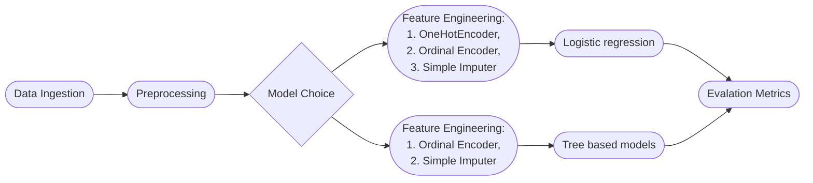

# AIAP11 Assessment


## Table of Contents
 - [Candidate Information](#a-candidate-information)
 - [Folder structure](#b-folder-structure)
 - [Pipeline and Configuration](#c-instructions-for-pipeline-and-configuration)
 - [Pipeline Flow Information](#d-pipeline-flow-information)
 - [Summary of EDA](#e-summary-of-eda-findings)
 - [Model Justification](#f-justification-of-model-choice)
 - [Evaluation of Metrics](#g-evaluation-of-model-metrics)
 - [Other Considerations](#h-other-considerations)

---

## A. Candidate Information

**Name:** Low Guangwen Daniel

**Email:** dlow017@e.ntu.edu.sg

---

## B. Folder Structure

Overview of the submitted folder and the folder structure

```bash
.
|-- README.md
|-- config
|-- data
|   `-- noshow.db
|-- eda.ipynb
|-- requirements.txt
|-- run.sh
|-- src
|   |-- app.py
|   |-- config
|   |   |-- config.yaml
|   |   `-- config_load.py
|   |-- extract.py
|   |-- mlpipe.py
|   `-- preprocess.py
`-- tests
    `-- test_extract.py
```

---

## C. Instructions for Pipeline and Configuration

### C.1 Deployment Information

The entire file system was created in a virtual environment using conda.

Please run the following steps in bash to replicate the virtual environment:

```bash
conda create -n aiap11 python=3.9.0
conda activate aiap11
conda install --file requirements.txt
```

Please run the following steps in bash to run the run.sh file

```bash
./run.sh
```


### C.2 Pipeline Configuration

The model config files can be found in config.yaml within the config folder of the src. The configurable parameters are categrized into:

 1. Data Location and table names
 2. Preprocess parameters
 3. Model parameters

```bash
src
|-- config
    |-- config.yaml
    `-- config_load.py
```


## D. Pipeline Flow Information

As far as possible, the intent was to use a similar data pipeline for all three models to increase model reusability. However, during the feature engineering phase wanted to optimize for the features that can get the best results from the different models.

Hence, the overall pipeline was built to create a common preprocessing step while using sklearn's inbuilt pipeline to do the feature engineering. Overall pipeline is as below:



Preprocessing steps undertaken

1. Splitting the price from currency and converting them to SGD using an average USD to SGD conversion rate (can be configured, see [yaml](#c2-pipeline-configuration))
2. 

Feature Engineering steps undertaken

1. One Hot Encoding - shows presence of values by columns, drops first column to prevent sparese data.
2. Ordinal Encoding:
    - Ordinal Encoder for those without missing values
    - Ordinal Encoder that encodes missing as -1 (e.g. labelling as missing)
3. Simple Imputer - for missing price values impute the mean price, can be configured to median

---

## E. Summary of EDA Findings

Overview of key findings from the EDA conducted in Task 1 and the choices made in the pipeline based on these findings, particularly any feature engineering. Please keep the
details of the EDA in the `.ipynb`, this section should be a quick summary.

Hence, decided to keep the following columns:

| Categories| Type| Reason|
|---|---|---|
| with_child | Boolean| Those with children have a 63.22% chance of no show |
| branch | Nominal Category| High proportion of no show for specific nationalities (CN, ID, MY)|
| country | Nominal Category| More no shows at the Changi vs Orchard Branches|
| first_time | Boolean| First time customers proportion of no show at 98.75% |
| SGD_price | Continuous Variable| Lower prices (mass market) tend to have more no shows|

Checking for imbalance dataset

- Dataset is not overly skewed towards either show or no show
- No show being around 37.04% of overall bookings
- Average cancellation rate on Booking.com and Expedia were 39% and 25% respectively [link](https://www.hoteliga.com/en/blog/how-to-reduce-no-shows-at-your-hotel)

---

## F. Justification of Model Choice


### F.1 Logistic Regression

Baseline Classifier Model

### F.2 Decision Tree Classifier

The decision tree was chosen as it would allow us to form a baseline metrics on how well basic trees can perform predictions on the dataset

### F.3 Random Forest Classifier

- Random Forest Model chosen over other decision tree models for example XGBoost due to the commercial nature of the question (hotel bookings)
- Typically in commmercial situations, changes in data can rapid and hence needed a model that can deal with variance errors better.
- Boosting models for eg XGBoost employs iterative strategy for adjusting an observation's weight based on the previous wrongly classified information, hence boosting models generally result in better prediction outcomes but may not always generalize well.
- Bagging models like Random Forest Classifiers create extra data by bagging (sampling with replacement) and create multiple parallel models of which mean predictions are chosen. Bagging models hence deal better with data randomness and data variation.

---

## G. Evaluation of Model Metrics

Evaluation of the models developed. Any metrics used in the evaluation should also be
explained.

1. Optimize for which metrics?
    - Should optimize for precision (i.e. Within those that we classified as no-show, how many of them are indeed no-show?)
2. Impact of False Positive (Type 1 error)?
    - For a reputable hotel chain the cost of a type 1 error is extremely high. 
    - Customers who booked and paid deposits would be disappointed if rooms are not ready or worse no-rooms available
3. Impact of False Negative (Type 2 error)?
    - Cost is limited to current ops cost (cost of leaving room vacant due to no-show)  

---

## H. Other Considerations

1. Ethical Considerations
    - Unsure whether to use country as a column even though it is somewhat predictive
    - Even if column is highly predictive, little actionable policies can be formulated
    - Negative impact of leaked algorithm selection might hurt the business.

---

## Evaluation

1. Appropriate data preprocessing and feature engineering
2. Appropriate use and optimisation of algorithms/models
3. Appropriate explanation for the choice of algorithms/models
4. Appropriate use of evaluation metrics
5. Appropriate explanation for the choice of evaluation metrics
6. Understanding of the different components in the machine learning pipeline
