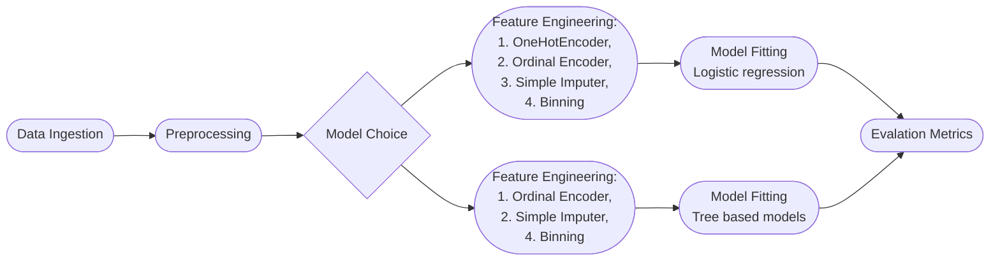

# Hotel Bookings

## A.Table of Contents

- [Folder structure](#b-folder-structure)
- [Pipeline and Configuration](#c-instructions-for-pipeline-and-configuration)
- [Pipeline Flow Information](#d-pipeline-flow-information)
- [Summary of EDA](#e-summary-of-eda-findings)
- [Model Justification](#f-justification-of-model-choice)
- [Evaluation of Metrics](#g-evaluation-of-model-metrics)
- [Other Considerations](#h-other-considerations)
- [Unit Testing with Pytest](#i-pytest)

---

## B. Folder Structure

Overview of the submitted folder and the folder structure

```bash
.
|-- README.md
|-- config
|-- data
|   `-- noshow.db
|-- eda.ipynb
|-- output
|   |-- Decision Tree Classifier_Evaluation_Metrics_2022-06-19-H10-M32-S55.txt
|   |-- Logistic Regression Classifier_Evaluation_Metrics_2022-06-19-H10-M32-S55.txt
|   `-- Random Forest Classifier_Evaluation_Metrics_2022-06-19-H10-M33-S01.txt
|-- requirements.txt
|-- run.sh
|-- src
|   |-- app.py
|   |-- config
|   |   |-- config.yaml
|   |   `-- config_load.py
|   |-- extract.py
|   |-- mlpipe.py
|   `-- preprocess.py
`-- tests
    |-- artifacts
    |   |-- X_test.csv
    |   |-- X_train.csv
    |   |-- ml_data.csv
    |   |-- processed_df.csv
    |   |-- y_pred_test.csv
    |   |-- y_pred_train.csv
    |   |-- y_test.csv
    |   `-- y_train.csv
    |-- test_extract.py
    |-- test_mlpipe.py
    `-- test_preprocess.py
```

---

## C. Instructions for Pipeline and Configuration

### C.1 Deployment Information

The entire file system was created in a virtual environment using conda.

Python 3.9 is required, please follow these steps to replicate the virtual environment:

```bash
conda create -n aiap11 python=3.9.0
conda activate aiap11
```

Install requirements file using:

```bash
pip install -r requirements.txt
```

Please execute the following steps in bash to run the run.sh file from root:

```bash
./run.sh
```

Please execute the following in bash to run the frontend.
```bash
python -m src.main
```

### C.2 Pipeline Configuration

The model config files can be found in config.yaml within the config folder of the src. The configurable parameters are categrized into:

 1. Data location and table names
 2. Preprocess parameters
 3. Model parameters

```bash
src
|-- config
    |-- config.yaml
    `-- config_load.py
```

## D. Pipeline Flow Information

As far as possible, the intent was to use a similar data pipeline for all three models to increase pipeline reusability, and to serve as a common baseline to compare the different models. However, during the feature engineering phase a similar pipeline across the three different models would have had higher computational cost (e.g. tree models need to work harder when computing sparse data). Hence I decided to optimize for the feature engineering steps that could get the best results in terms of both evaluation metrics and time from the different models.

Hence, the overall pipeline was built to create a common preprocessing step while using sklearn's inbuilt pipeline to do the feature engineering. Overall pipeline is as below:
| Step | File Location |Purpose |
|---|---|---|
| Data ingestion | extract.py | Connect and query database provided in config|
| Preprocess | preprocess.py | Data cleaning and create new data types |
| Feature Engineering | mlpipe.py | Employ feature engineering steps |
| Model | mlpipe.py | Fit model to output of engineered data|
| Evaluation Metrics | mlpipe.py | Run selected evaluation metrics on model output|

The output of the pipleline is saved in the output folder of the directory as a txt file.



Preprocessing steps undertaken:

| Errors | Columns | Error Type (Assumption) | Treatment |
|---|---|---|---|
|Empty rows| All columns| Database parsing error | Removal of empty rows |
|Free text error |num_adults| Data entry error| Converted text and numbers into numbers. Allow for up to 10 people in a presidential suite. [ref](https://www.suiteness.com/blog/connecting-suites-suites-different-rooms)|
|Boolean|first_time, no_show| Type error | Converted float to boolean|
|Free text error|arrival_month| Data entry error| Changed to title case|
|Negative numbers in days|checkout_day| Data entry error| Return the absolute of those days|
|Float point numbers|num_adults, arrival_day, checkout_day, num_children| Database parsing error | Converted float to integer|
|Currency and price in same column|price|Database planning error|Split out currency and price and converting them to SGD using an average USD to SGD conversion rate (can be configured, see [yaml](#c2-pipeline-configuration))|

Feature Engineering steps undertaken:

1. One Hot Encoding - Ehows presence of values by columns, drops first column to prevent sparse data.
2. Ordinal Encoding - Encodes the presence of values in order (e.g. 1, 2, 3, 4). Allows model to distinguish patterns between data series. In this case the ordinal encoder also encoded missing values as -1 (e.g. labelling as missing).
3. Simple Imputer - For missing price values impute the mean price, can be configured to median.

---

## E. Summary of EDA Findings

The key findings during the EDA process is summarized into the following table:

| Categories| Type| Reason|
|---|---|---|
| with_child | Boolean| Those with children have a 63.22% chance of no show |
| branch | Nominal Category| High proportion of no show for specific nationalities (CN, ID, MY)|
| country | Nominal Category| More no shows at the Changi vs Orchard branch|
| first_time | Boolean| First time customers proportion of no show at 98.75% |
| platform| Nominal Category| Certain platforms websites have higher proportion of no show thatn others 45.34%|
| price_type| Ordinal Category| Certain price ranges have higher proportion of no show than others|
| SGD_price | Continuous Variable| Lower prices (mass market) tend to have more no shows|

Additional Information

- Decided to keep the above columns within the dataset as they were most indicitive of either a show or no show. (Summarized in reason column on table above)
    - Columns can be adjusted using config file.
- Of the above columns, both "with_child" and "SGD_price" were created from "num_children" and "price" columns respectively.
- Checking for imbalance dataset:
  - Dataset is not overly skewed towards either show or no show.
  - No show being around 37.04% of overall bookings.
  - Average cancellation rate on Booking.com and Expedia ranged between 39% and 25%. [link](https://www.hoteliga.com/en/blog/how-to-reduce-no-shows-at-your-hotel)

---

## F. Justification of Model Choice

### 1. Logistic Regression

- The logistic regession model (LR) was chosen as a baseline for comparing other classification models DT and RF.
- LR model allows for configuration between solver, penalty, c strength and iterations.
- Linear models can improve model prediction when they are allowed to regularize parameters that might not be useful. Through this shrinkage method we can allow the model to avoid overfitting to the data.
- By applying the different levers in configuration file we are able to allow the LR model to better classify the data.

### 2. Decision Tree Classifier

- The decision tree (DT) was chosen as it would allow us to form a baseline metrics on how well basic trees can perform predictions on the dataset.
- DT model allows for configuration between maximum depth of tree and minimum split size of each node, as the main issue with decision trees are that they tend to overfit if allowed to grow to the maximum length.
- By applying the different configurations and by observing the difference in the train and test set output we should find a generalized model that can best classify show/no show cases.

### 3. Random Forest Classifier

- Random Forest Model (RF) chosen over other decision tree models, for example ADABoost, due to the commercial nature of the question (hotel bookings)
- Typically in commmercial situations, changes in data can rapid and hence needed a model that can deal with variance errors better.
- Boosting models for eg ADA boost employs iterative strategy for adjusting an observation's weight based on the previous wrongly classified information, hence boosting models generally result in better prediction outcomes, but may not always generalize well.
- Bagging models like Random Forest Classifiers create extra data by bagging (sampling with replacement) and create multiple parallel models of which predictions are chosen via majority vote. Bagging models hence deal better with data randomness and data variation.

---

## G. Evaluation of Model Metrics

Task: Formulate policies to reduce expenses incurred due to No-Shows. Some of the policies created might include:

| Policy Proposals | Cost savings | Drawbacks |
|---|---|---|
|Lower prioritzation of clean up for high potential no show rooms| Lesser overall housekeeping resources used| Delayed guest experience during check-in period|
|Double book a proportion of rooms with high potential to no-show| Possible extra revenue from new bookings| Potential disapointment from guest who do indeed show up (false positive)|

1. Optimize for which metrics?
    - Should optimize for **precision** (i.e. Within those that we classified as no-show, how many of them are indeed no-show?)
    - Cost of false positive (reputation damage) is greater than impact of false negative (lost sales).
2. Impact of False Positive (Type 1 error)?
    - For a reputable hotel chain the cost of a type 1 error is extremely high.
    - Customers who booked and paid deposits would be disappointed if rooms are not ready or worse no-rooms available
3. Impact of False Negative (Type 2 error)?
    - Cost is limited to current ops cost (cost of leaving room vacant due to no-show)  

---

## H. Other Considerations

1. Ethical Considerations
    - Unsure whether to use country as a column even though it is somewhat predictive
    - Even if column is highly predictive, little actionable policies can be formulated
    - Negative impact of leaked algorithm selection might hurt the reputation of the business, perceived as discriminatory.

---

## I. Pytest

Activate pytest using

```bash
python -m pytest -v
```
Test cases:


---

## Kudos

Here are some references to industry specifc websites I used to understand the problem better.

1. [Manuel Banza, Predicting Hotel Booking Cancellations Using Machine Learning](https://www.linkedin.com/pulse/u-hotel-booking-cancellations-using-machine-learning-manuel-banza/)
2. [Susana Castro, No-Show, Cancellations, Walk-ins and the Overbooking pain in hotels](https://revmanager.eu/cancellations-overbooking-noshow-hotels/)
